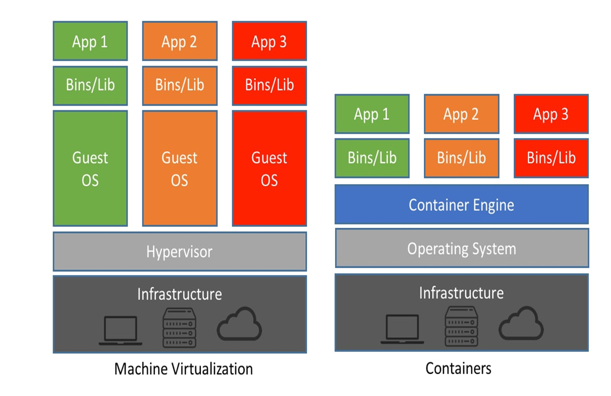
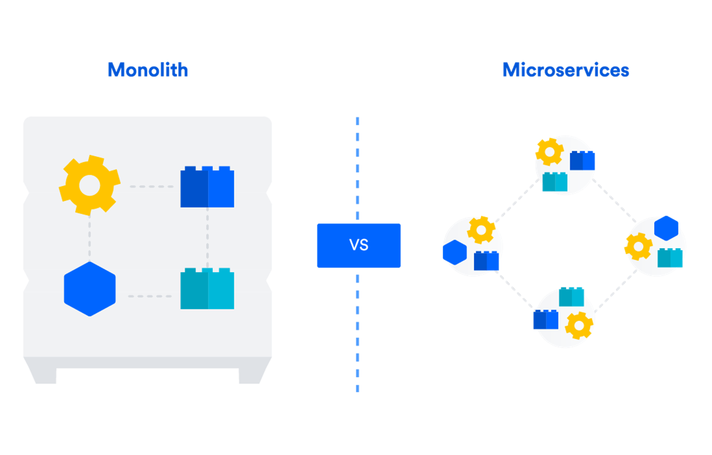
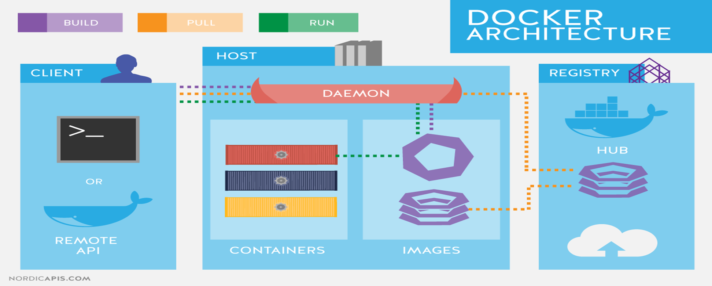
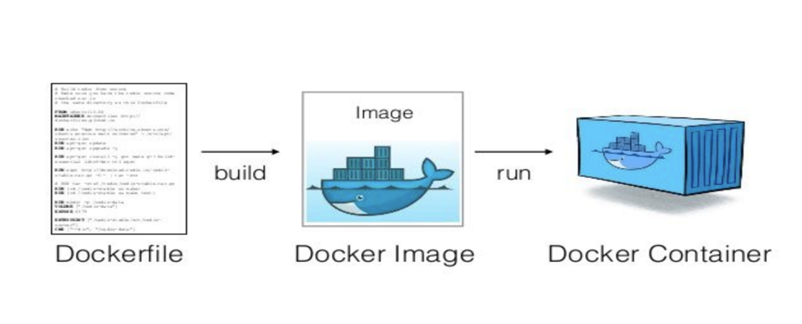

# 🐳 Yonder Docker Workshop

## Wat zijn containers?

Containers zijn lichtgewicht, draagbare software-eenheden waarin een applicatie samen met alle benodigde afhankelijkheden (zoals bibliotheken en binaries) verpakt zit.  
In tegenstelling tot virtuele machines delen containers de kernel van het host-besturingssysteem, waardoor ze efficiënter en sneller zijn.  
Containers zorgen ervoor dat software betrouwbaar werkt, ongeacht de omgeving.

## Waarom containers?

Containers bieden veel voordelen:  

- **Efficiëntie**: Ze hebben minder resources nodig dan virtuele machines, omdat ze geen volledig besturingssysteem per instantie nodig hebben.
- **Portabiliteit**: Applicaties draaien consistent op verschillende omgevingen (lokaal, test, productie).
- **Snelheid**: Containers starten veel sneller op dan VMs, wat zorgt voor snellere deploys.
- **Isolatie**: Elke container draait geïsoleerd, wat zorgt voor veiligheid en stabiliteit.

## Wanneer containers?

Containers zijn vooral nuttig in de volgende situaties:  

- Microservices-architectuur waarbij elke service apart kan draaien en schalen.
- CI/CD (Continuous Integration / Continuous Deployment) om builds en tests consistent te houden.
- Cloud-native applicaties die flexibiliteit en snelle schaalbaarheid vereisen.
- Modernisering van legacy applicaties zonder volledige herbouw.

## Containers vs Servers (Virtuele Machines)



- **Machine Virtualisatie (links)**: Elke applicatie draait in een eigen virtuele machine met een volledig guest-besturingssysteem. Dit zorgt voor extra overhead.
- **Containers (rechts)**: Alle containers delen het besturingssysteem van de host en draaien via een container engine (zoals Docker). Hierdoor zijn ze lichter en sneller op te starten.

## Schaalbaarheid

Containers zijn zeer schaalbaar. Omdat ze snel starten en weinig resources gebruiken, kunnen ze eenvoudig worden opgeschaald of afgeschaald afhankelijk van de belasting.  
Dit is ideaal voor cloudomgevingen met dynamische workloads.

## Monolithisch vs Micro/Serverless Architectuur



- **Monolithisch**: Eén grote applicatie waarbij alle onderdelen met elkaar verbonden zijn. Moeilijk te updaten of te schalen.
- **Microservices**: Elke functie of service draait in een eigen container. Makkelijker te beheren, onafhankelijk te deployen en te schalen.
- **Serverless**: Code wordt uitgevoerd wanneer nodig, zonder dat je de onderliggende infrastructuur beheert. Serverless en containers worden vaak samen gebruikt.

---

**De Theorie bij opdracht 1**  



*Overzicht van de Docker-architectuur*  

1. Client
Links zie je de Docker Client. Dit is het onderdeel waarmee de gebruiker communiceert, meestal via de opdrachtregel (CLI) of via een Remote API. De gebruiker voert commando’s uit zoals:  

- docker build
- docker pull
- docker run

Deze opdrachten worden doorgegeven aan de Docker Daemon.  

2. Daemon (Docker Engine)

De Docker Daemon (de rode boot in het midden) draait op de host en voert de commando’s van de client uit. Het beheert:  

- Containers
- Images
- Netwerken
- Volumes

De Daemon zorgt ervoor dat containers worden gestart, gestopt en beheerd.  

3. Containers

Aan de linkerkant in het host-gedeelte zie je drie containers in verschillende kleuren (rood, blauw, geel).  
Dit zijn de draaiende instanties van Docker-images.  
Ze bevatten de applicaties die in isolatie draaien.  

4. Images

In het midden onder de Daemon staan gestapelde Docker-images.  
Een image is een alleen-lezen sjabloon met de instructies om een container te maken (zoals een snapshot van een OS + applicatie).  
De daemon gebruikt deze om containers te starten.

5. Registry

Rechts staat de Docker Registry, bijvoorbeeld Docker Hub.  
Dit is een centrale opslagplaats waar Docker-images worden opgeslagen en gedeeld.  

- Je kunt images pullen (downloaden) van de hub.
- Je kunt zelfgebouwde images pushen (uploaden) naar de hub zodat anderen ze kunnen gebruiken.

*Kleurenlegenda*  

- Paars (Build): De client bouwt een image met een Dockerfile.
- Oranje (Pull): Een image wordt opgehaald vanuit een registry zoals Docker Hub.
- Groen (Run): Een image wordt als container uitgevoerd door de daemon.

---

**Opdracht 1: Install Docker**  

- [Windows Install](https://docs.docker.com/desktop/setup/install/windows-install/)
- [Mac Install](https://docs.docker.com/desktop/setup/install/mac-install/)
- [Linux Install](https://docs.docker.com/desktop/setup/install/linux/)

---

**Opdracht 2: Docker CLI (Basic)**  

```Bash
# Runs docker container with hostport 1111 and containerport 80 in detached mode.
docker run -d -p 11111:80 docker/getting-started

# Runs docker container with hostport 8080 and containerport 80 in detached mode.
docker run -d -p  8080:80 nginx:latest

# Runs docker container with default container settings in detached mode.
docker run -d mysql:latest
```

**Opdracht 2: Docker CLI (Advanced)**  

```Bash
### Runs docker container with the name wordpress-mysql with the env vars for the root password, the database name and it runs in detached mode.
docker run -d --name wordpress-mysql -e MYSQL_ROOT_PASSWORD=dit-is-super-geheim -e MYSQL_DATABASE=wordpress mysql:latest

### Runs docker container with the name wordpress with the env vars to connect wordpress to the database, with hostport 8080, container port 80, that links wordpress to the database container and it runs in detached mode.
docker run -d --name wordpress -e WORDPRESS_DB_HOST=wordpress-mysql:3306 -e WORDPRESS_DB_NAME=wordpress -e WORDPRESS_DB_USER=root -e WORDPRESS_DB_PASSWORD=dit-is-super-geheim -p 8080:80 --link wordpress-mysql:mysql wordpress
```

Access WordPress at: [http://localhost:8080](http://localhost:8080)

---

**De Theorie bij opdracht 3 & 4**  



*Containers bouwen/builden/bakken*  

1. Dockerfile  

Links zie je een Dockerfile.  
Dit is een tekstbestand met een reeks instructies die beschrijven hoe een Docker-image moet worden gebouwd.  
Typische instructies zijn:

- Welk basisonderdeel te gebruiken (FROM)
- Welke commando’s moeten worden uitgevoerd (RUN)
- Welke bestanden gekopieerd moeten worden (COPY)
- Welk commando moet worden uitgevoerd bij opstarten (CMD)

Dit is als het ware het “recept” voor de image.  

2. Docker Image  

In het midden zie je de Docker Image.  
Dit is het resultaat van het uitvoeren van de docker build opdracht op een Dockerfile.  

Een Docker image is een statische blauwdruk waarin alles zit wat nodig is om een container te draaien: code, bibliotheken, configuraties, enzovoort.  

3. Docker Container  

Rechts zie je de Docker Container.  
Dit is een draaiende instantie van een image.  
Je start deze door docker run uit te voeren.

De container is geïsoleerd van het systeem, maar deelt wel de kernel van het besturingssysteem.  
Hierdoor zijn containers lichtgewicht en snel op te starten.

Samenvatting van het proces:

- Dockerfile → (build) → Docker Image
- Docker Image → (run) → Docker Container

---

**Opdracht 3: Creating the manifest**  

## 📁 Dockerfile for MySQL

```Dockerfile
# Dockerfile.mysql
#FROM gets the base image for the build.
FROM mysql:latest

#ENV sets the required and optional variables for the mysql database.
ENV MYSQL_ROOT_PASSWORD=dit-is-super-geheim
ENV MYSQL_DATABASE=wordpress
```

## 📁 Dockerfile for WordPress

```Dockerfile
# Dockerfile.wordpress
#FROM gets the base image for the build.
FROM wordpress:latest

#ENV sets the required variables for the wordpress application.
ENV WORDPRESS_DB_HOST=wordpress-mysql:3306
ENV WORDPRESS_DB_NAME=wordpress
ENV WORDPRESS_DB_USER=root
ENV WORDPRESS_DB_PASSWORD=dit-is-super-geheim
```

---

**Opdracht 4: Building the images**  

## 🏗️ Build the Images

```bash
# Build MySQL image with a tag based on the Dockerfile in the ./mysql-wordpress folder. (Change the tag to something like: mysql:yonder)
docker build -t francois013/yonder-workshop:mysql ./mysql-wordpress

# Build WordPress image with a tag based on the Dockerfile in the ./wordpress folder. (Change the tag to something like: wordpress:yonder)
docker build -t francois013/yonder-workshop:wordpress ./wordpress
```

---

**Opdracht 5: Run the containers**  

## 🚀 Run the Containers

```bash
# Start MySQL container with the name wordpress-mysql in detached mode.
docker run -d --name wordpress-mysql francois013/yonder-workshop:mysql

# Runs Wordpress container with the name wordpress with hostport 8080, container port 80, that links wordpress to the database container and it runs in detached mode. 
docker run -d --name wordpress -p 8080:80 --link wordpress-mysql:mysql francois013/yonder-workshop:wordpress
```

Access WordPress at: [http://localhost:8080](http://localhost:8080)

---

## ⚠️ Notes

- These Dockerfiles **bake secrets into the image** (like DB passwords). Do **not** use this approach for production.
- For a secure and flexible alternative, prefer `docker-compose.yml` with `.env` files.

---

## Contactgegevens

**LinkedIn**: https://www.linkedin.com/in/fmeulenberg/

---

## Gratis studiematerialen

[Introduction to Linux (LFS101)](https://trainingportal.linuxfoundation.org/courses/introduction-to-linux-lfs101)  
[Introduction to Kubernetes (LFS158)](https://trainingportal.linuxfoundation.org/courses/introduction-to-kubernetes)  
[Introduction to Serverless on Kubernetes (LFS157)](https://trainingportal.linuxfoundation.org/courses/introduction-to-serverless-on-kubernetes-lfs157)  
[Introduction to GitOps (LFS169)](https://trainingportal.linuxfoundation.org/courses/introduction-to-serverless-on-kubernetes-lfs157)  
[Introduction to Cloud Infrastructure Technologies (LFS151)](https://trainingportal.linuxfoundation.org/courses/introduction-to-cloud-infrastructure-technologies)  
